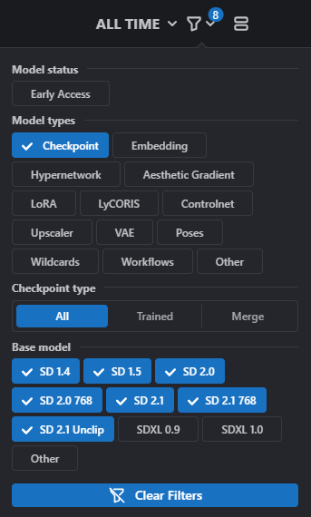

# colab_diffusers_with_civitai_checkpoint_model

GoogleColab上で[civitai](https://civitai.com/)のモデルを[Diffusers](https://huggingface.co/docs/diffusers/index)で読み込み、画像生成を行う事のできるノートブックです

## Colab

## 使い方
1. [civitai/model](https://civitai.com/models)にアクセスします
2. モデルにフィルターを掛けます 
使用できるモデルはCheckpointかつ、SDモデルのみ(SDXLは未対応)です

3. モデルのダウンロードリンクをコピーします

4. MODEL_URLにダウンロードリンクを貼り付けます
5. Setupのコードを実行します
6. 画像生成のパラメータ（プロンプト）を入力しGenerate Imageのコードを実行します